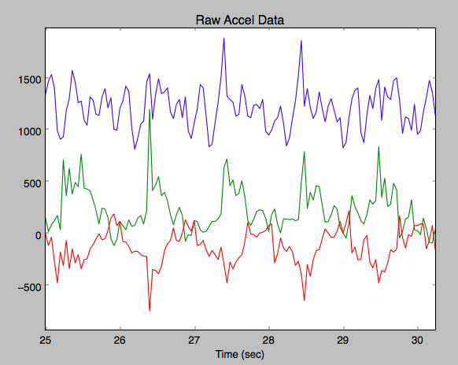
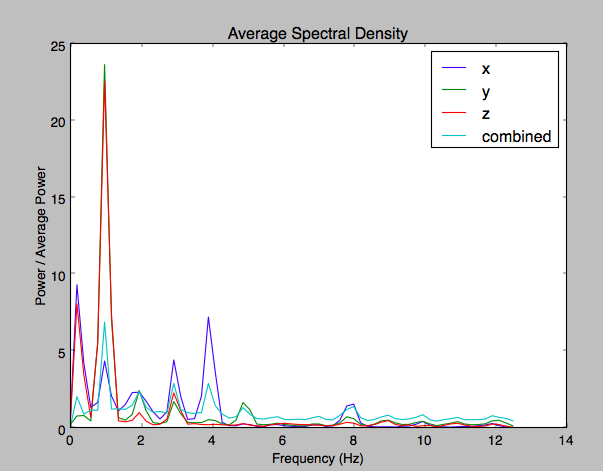
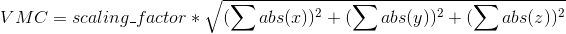
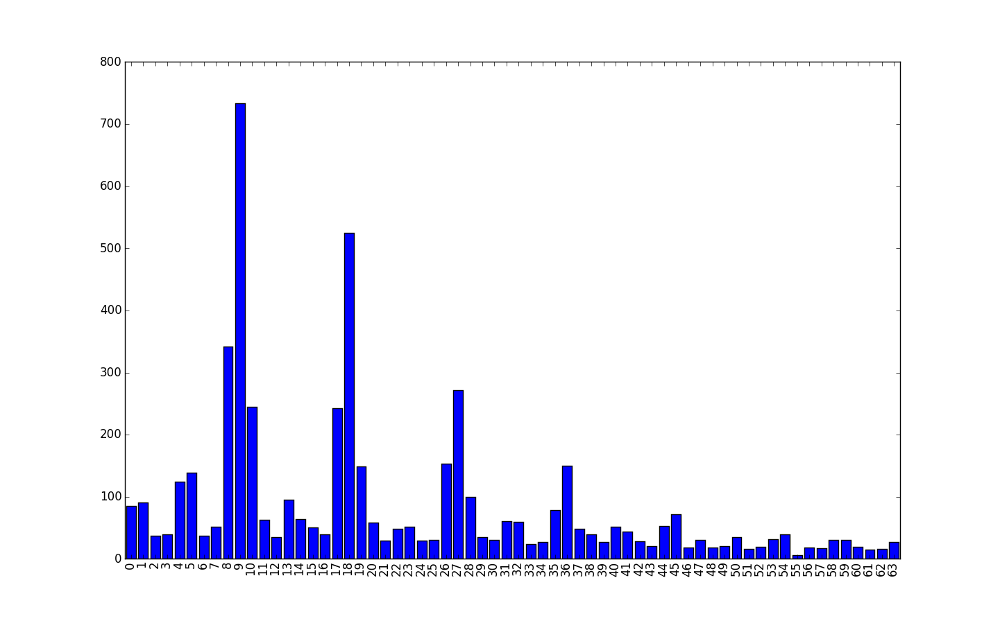
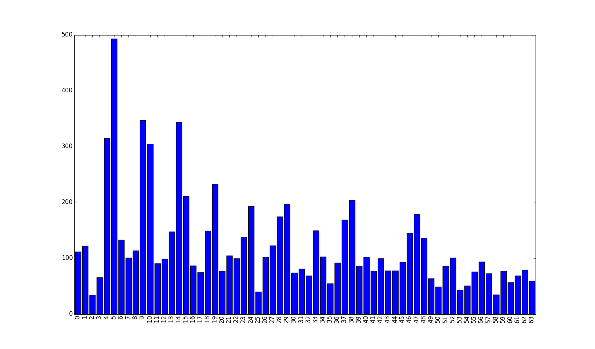
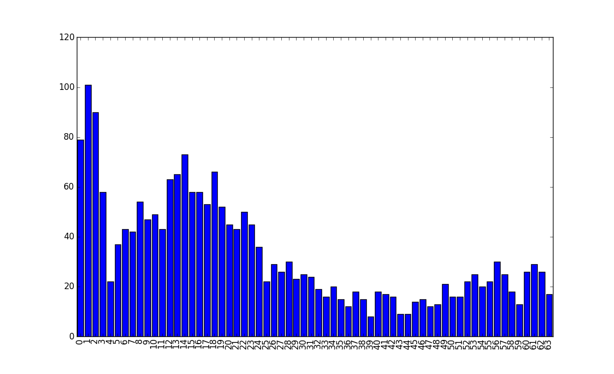
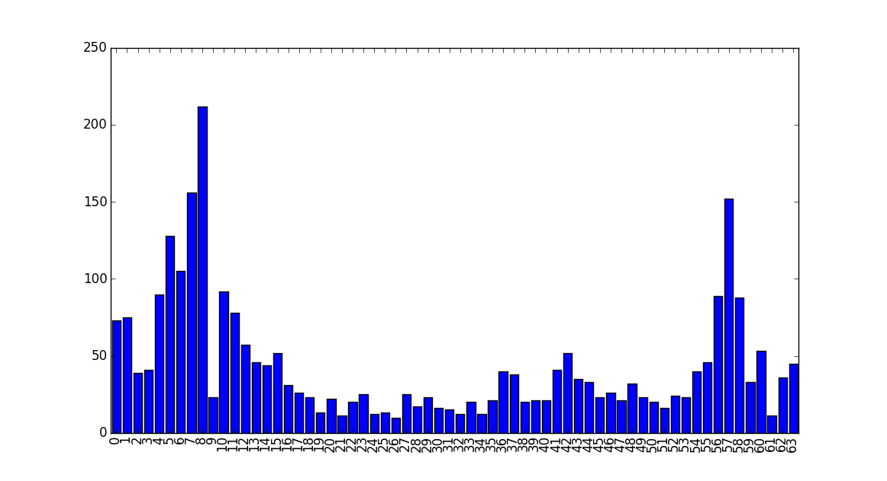

# Health Algorithms
## Step Counting
The step counting algorithm uses input from the accelerometer sensor to detect when the user is walking and how many steps have been taken. The accelerometer measures acceleration in each of 3 axes: x, y, and z. A perfectly still watch resting flat on a table will have 1G (1 “Gravity”) of acceleration in the z direction (due to gravity) and 0G’s in both the x and y axes. If you tilt the watch on its side for example, the z reading will go to 0 and then either x or y will show +/-1G (depending on which of the 4 sides you tilt it to). During watch movement, the x, y, and z readings will vary over time due to the watch’s changing orientation to gravity as well as the acceleration of the watch when it changes direction or speed. The pattern of these variations in the accelerometer readings over time can be used to detect if, and how fast, the user is stepping.

There are generally two dominant signals that show up in the accelerometer readings when a person is walking or running. The first is the signal due to your feet hitting the ground. This signal shows up as a spike in the accelerometer readings each time a foot hits the ground and will be more or less pronounced depending on the cushioning of your shoes, the type of flooring, etc. Another signal that can show up is from the arm swinging motion, and the strength of this will vary depending on the user’s walking style, whether their hand is in their pocket or not, whether they are carrying something, etc. 

Of these two signals, the foot fall one is the most reliable since a user will not always be swinging their arms when walking. The goal of the step tracking algorithm is to isolate and detect this foot fall signal, while not getting confused by other signals (arm swings, random arm movements, etc.). 

An overall outline of the approach taken by the stepping algorithm (glossing over the details for now) is as follows:

1. Separate the accelerometer sensor readings into 5 second epochs.
2. For each 5 second epoch, compute an FFT (Fast Fourier Transform) to get the energy of the signal at different frequencies (called the _spectral density_)
3. Examine the FFT output using a set of heuristics to identify the foot fall signal (if present) and its frequency.
4. The frequency of the foot fall signal (if present) is outputted as the number of steps taken in that epoch.

As an example, if the FFT of a 5 second epoch shows a significant amount of foot fall signal at a frequency of 2Hz, we can assume the person has walked 10 steps (2Hz x 5 seconds) in that epoch. 

### Example Data
The following figure shows an example of the raw accelerometer data of a five-second epoch when a user is walking 10 steps. The x, y, and z axis signals are each shown in a different color. In this plot, there is a fairly evident five-cycle rhythm in the red and green axes, which happens to be the arm swing signal (for every 2 steps taken, only 1 full arm swing cycle occurs). The ten-cycle foot fall signal however is difficult to see in this particular sample because the arm swing is so strong. 

The spectral density of that same walk sample, showing the amount of energy present at different frequencies, is shown in the following figure (this particular plot was generated from a sample longer than 5 seconds, so will be less noisy than any individual 5 second epoch). Here, the spectral density of the x, y, and z axes as well as the combined signal are each plotted in a different color. The _combined_ signal is computed as the magnitude of the x, y, and z spectral density at each frequency:
	combined[f] = sqrt(x[f]^2 + y[f]^2 + z[f]^2)

_Note that the y axis on this plot is not simply Power, but rather “Power / Average Power”, where “Average Power” is the average power of that particular signal._

You can see in the above spectral density plot that the dominant frequency in this example is 1Hz, corresponding to the 5 arm swings that occurred in these 5 seconds. 

There are also several smaller peaks at the following frequencies:

- ~.25Hz: non-stepping signal, most likely random arm movements
- 2Hz: stepping frequency + 2nd harmonic of arm swing
- 3Hz: 3rd harmonic of arm swing
- 4Hz: 2nd harmonic of steps + 4th harmonic of arm swing
- 5Hz: 5th harmonic of arm swing
- 8Hz: 4th harmonic of steps

The logic used to pull out and identify the stepping signal from the spectral density output will be described later, but first we have to introduce the concept of VMC, or Vector Magnitude Counts. 

### VMC

VMC, or Vector Magnitude Counts, is a measure of the overall amount of movement in the watch over time. When the watch is perfectly still, the VMC will be 0 and greater amounts of movement result in higher VMC numbers. Running, for example results in a higher VMC than walking. 

The VMC computation in Pebble Health was developed in conjunction with the Stanford Wearables lab and has been calibrated to match the VMC numbers produced by the [Actigraph](http://www.actigraphcorp.com/product-category/activity-monitors/) wrist-worn device. The Actigraph is commonly used today for medical research studies. The Stanford Wearables lab will be publishing the VMC computation used in the Pebble Health algorithm and this transparency of the algorithm will enable the Pebble to be used for medical research studies as well. 

VMC is computed using the formula below. Before the accelerometer readings are incorporated into this computation however, each axis’ signal is run through a bandpass filter with a design of 0.25Hz to 1.75Hz.

The following pseudo code summarizes the VMC calculation for N samples worth of data in each axis. The accelerometer is sampled at 25 samples per second in the Health algorithm, so the VMC calculation for 1 second’s worth of data would process 25 samples from each axis. The _bandpass\_filter_ method referenced in this pseudo code is a convolution filter with a frequency response of 0.25 to 1.75Hz:

	for each axis in x, y, z:
	  axis_sum[axis] = 0
	  for each sample in axis from 0 to N:
	    filtered_sample = bandpass_filter(sample, 
	                                      filter_state)	
	    axis_sum[axis] += abs(filtered_sample)
	
	VMC = scaling_factor * sqrt(axis_sum[x]^2 
	                            + axis_sum[y]^2 
	                            + axis_sum[z]^2)
	

The step algorithm makes use of a VMC that is computed over each 5-second epoch. In addition to this 5-second VMC, the algorithm also computes a VMC over each minute of data. It saves this 1-minute VMC to persistent storage and sends it to data logging as well so that it will eventually get pushed to the phone and saved to a server. The 1-minute VMC values stored in persistent storage can be accessed by 3rd party apps through the Health API. It is these 1-minute VMC values that are designed to match the Actigraph computations and are most useful to medical researcher studies. 

### Step Identification

As mentioned above, accelerometer data is processed in chunks of 5 seconds (one epoch) at a time. For each epoch, we use the combined spectral density (FFT output) and the 5-second VMC as inputs to the step identification logic. 

#### Generating the FFT output
The accelerometer is sampled at 25Hz, so each 5 second epoch comprises 125 samples in each axis. An FFT must have an input width which is a power of 2, so for each axis, we subtract the mean and then 0-extend to get 128 samples before computing the FFT for that axis. 

An FFT of a real signal with 128 samples produces 128 outputs that represent 64 different frequencies. For each frequency, the FFT produces a real and an imaginary component (thus the 128 outputs for 64 different frequencies). The absolute value of the real and imaginary part denote the amplitude at a particular frequency, while the angle represents the phase of that frequency. It is the amplitude of each frequency that we are interested in, so we compute sqrt(real^2 + imag^2) of each frequency to end up with just 64 outputs. 

Once the 64 values for each of the 3 axes have been computed, we combine them to get the overall energy at each frequency as follows:

	for i = 0 to 63:
	  energy[i] = sqrt(amp_x[i]^2 + amp_y[i]^2 + amp_z[i]^2)

In this final array of 64 elements, element 0 represents the DC component (0 Hz), element 1 represents a frequency of 1 cycle per epoch (1 / 5s = 0.2Hz), element 2 represents a frequency of 2 cycles per epoch (2 / 5s = 0.4Hz), etc. If the user is walking at a rate of 9 steps every 5 seconds, then a spike will appear at index 9 in this array (9 / 5s = 1.8Hz). 

As an example, the following shows the FFT output of a user walking approximately 9 steps in an epoch (with very little arm swing):

#### Determining the stepping frequency

Once the FFT output and VMC have been obtained, we search for the most likely stepping frequency. The naive approach is to simply locate the frequency with the highest amplitude among all possible stepping frequencies. That would work fine for the example just shown above where there is a clear peak at index 9 of the FFT, which happens to be the stepping frequency. 

However, for some users the arm swinging signal can be as large or larger than the stepping signal, and happens to be at half the stepping frequency. If a user is walking at a quick pace, the arm swinging signal could easily be misinterpreted as the stepping signal of a slow walk. The following is the FFT of such an example. The stepping signal shows up at indices 9 and 10, but there is a larger peak at the arm-swing frequency at index 5. 

To deal with these possible confusions between arm-swing and stepping signals, the VMC is used to narrow down which range of frequencies the stepping is likely to fall in. Based on the VMC level, we search one of three different ranges of frequencies to find which frequency has the most energy and is the likely stepping frequency. When the VMC is very low, we search through a range of frequencies that represent a slow walk, and for higher VMCs we search through ranges of frequencies that represent faster walks or runs. 

Once we find a stepping frequency candidate within the expected range, we further refine the choice by factoring in the harmonics of the stepping/arm swinging. Occasionally, a max signal in the stepping range does not represent the actual stepping rate - it might be off by one or two indices due to noise in the signal, or it might be very close in value to the neighboring frequency, making it hard to determine which is the optimal one to use. This is evident in the arm-swinging output shown above where the energy at index 9 is very close to the energy at index 10. 

As mentioned earlier, we often see significant energy at the harmonics of both the arm-swinging and the stepping frequency. A harmonic is an integer multiple of the fundamental frequency (i.e. a stepping frequency of 2 Hz will result in harmonics at 4Hz, 6Hz, 8Hz, etc.). To further refine the stepping frequency choice, we evaluate all possible stepping frequencies near the first candidate (+/- 2 indices on each side) and add in the energy of the harmonics for each. For each evaluation, we add up the energy of that stepping frequency, the arm energy that would correspond to that stepping frequency (the energy at half the stepping frequency), and the 2nd thru 5th harmonics of both the stepping and arm-swinging frequencies. Among these 5 different candidate stepping frequencies, we then choose the one that ended up with the most energy overall. 

At the end of this process, we have the most likely stepping frequency, **if** the user is indeed walking. The next step is to determine whether or not the user is in fact walking or not. 

#### Classifying step vs non-step epochs

In order to classify an epoch as walking or non-walking, we compute and check a number of metrics from the FFT output. 

The first such metric is the _walking score_ which is the sum of the energy in the stepping related frequencies (signal energy) divided by the sum of energy of all frequencies (total energy). The signal energy includes the stepping frequency, arm-swing frequency, and each of their harmonics. If a person is indeed walking, the majority of the signal will appear at these signal frequencies, yielding a high walking score. 

The second constraint that the epoch must pass is that the VMC must be above a _minimum stepping VMC_ threshold. A higher threshold is used if the detected stepping rate is higher. 

The third constraint that the epoch must pass is that the amount of energy in the very low frequency components must be relatively low. To evaluate this constraint, the amount of energy in the low frequency components (indices 0 through 4) is summed and then divided by the signal energy (computed above). If this ratio is below a set _low frequency ratio_ threshold, the constraint is satisfied. The example below is typical of many epochs that are non-stepping epochs - a large amount of the energy appears in the very low frequency area. 

The fourth and final constraint that the epoch must pass is that the energy in the high frequencies must be relatively low. To evaluate this constraint, the amount of energy in the high frequency components (index 50 and above) is summed and then divided by the signal energy. If this ratio is below a set _high frequency ratio_ threshold, the constraint is satisfied. This helps to avoid counting driving epochs as stepping epochs. In many instances, the vibration of the engine in a car will show up as energy at these high frequencies as shown in the following diagram.

#### Partial Epochs

If the user starts or ends a walk in the middle of an epoch, the epoch will likely not pass the checks for a full fledged stepping epoch and these steps will therefore not get counted. To adjust for this undercounting, the algorithm introduces the concept of _partial epochs_. 

The required _walking score_ and _minimum VMC_ are lower for a partial epoch vs. a normal epoch and there are no constraints on the low or high frequency signal ratios. To detect if an epoch is a _partial epoch_ we only check that the _walking score_ is above the _partial epoch walking score_ threshold and that the VMC is above the _partial epoch minimum VMC_ threshold. 

If we detect a partial epoch, and either the prior or next epoch were classified as a stepping epoch, we add in half the number of steps that were detected in the adjacent stepping epoch. This helps to average out the undercounting that would normally occur at the start and end of a walk. For a very short walk that is less than 2 epochs long though, there is still a chance that no steps at all would be counted. 

---- 

## Sleep Tracking

The sleep tracking algorithm uses the minute-level VMC values and minute-level average orientation of the watch to determine if/when the user is sleeping and whether or not the user is in “restful” sleep. 

The minute-level VMC was described above. It gives a measure of the overall amount of movement seen by the watch in each minute. 

The average orientation is a quantized (currently 8 bits) indication of the 3-D angle of the watch. It is computed once per minute based on the average accelerometer reading seen in each of the 3 axes. The angle of the watch in the X-Y plane is computed and quantized into the lower 4 bits and the angle of that vector with the Z-axis is then quantized and stored in the upper 4 bits. 

### Sleep detection

The following discussion uses the term _sleep minute_. To determine if a minute is a _sleep minute_, we perform a convolution of the VMC values around that minute (using the 4 minutes immediately before and after the given minute) to generate a _filtered VMC_ and compare the _filtered VMC_ value to a threshold. If the result is below a determined sleep threshold, we count it as a _sleep minute_. 

A rough outline of the sleep algorithm is as follows. 

1. Sleep is entered if there are at least 5 _sleep minutes_ in a row. 
2. Sleep continues until there are at least 11 non-_sleep minutes_ in a row. 
3. If there were at least 60 minutes between the above sleep enter and sleep exit times, it is counted as a valid sleep session.

There are some exceptions to the above rules however:

- After sleep has been entered, if we see any minute with an exceptionally high _filtered VMC_, we end the sleep session immediately. 
- If it is early in the sleep session (the first 60 minutes), we require 14 non-_sleep minutes_ in a row to consider the user as awake instead of 11. 
- If at least 80% of the minutes have slight movement in them (even if each one is not high enough to make it a non-_sleep minute_), we consider the user awake. 
- If we detect that the watch was not being worn during the above time (see below), we invalidate the sleep session. 

#### Restful sleep

Once we detect a sleep session using the above logic, we make another pass through that same data to see if there are any periods within that session that might be considered as _restful sleep_. 

A _restful sleep minute_ is a minute where the _filtered VMC_ is below the _restful sleep minute_ threshold (this is lower than the normal _sleep minute_ threshold). 

1. Restful sleep is entered if there are at least 20 _restful sleep minutes_ in a row. 
2. Restful sleep continues until there is at least 1 minute that is not a _restful sleep minute_.

### Detecting not-worn

Without some additional logic in place, the above rules would think a user is in a sleep session if the watch is not being worn. This is because there would be no movement and the VMC values would all be 0, or at least very low. 

Once we detect a possible sleep session, we run that same data through the “not-worn” detection logic to determine if the watch was not being worn during that time. This is a set of heuristics that are designed to distinguish not-worn from sleep. 

The following description uses the term _not worn minute_. A _not worn minute_ is a minute where **either** of the following is true:

- The VMC (the raw VMC, not _filtered VMC_) is below the _not worn_ threshold and the average orientation is same as it was the prior minute
- The watch is charging

If we see **both** of the following, we assume the watch is not being worn:

1. There are at least 100 _not worn_ minutes in a row in the sleep session
2. The _not worn_ section from #1 starts within 20 minutes of the start of the candidate sleep session and ends within 10 minutes of the end of the candidate sleep session. 

The 100 minute required run length for _not worn_ might seem long, but it is not uncommon to see valid restful sleep sessions for a user that approach 100 minutes in length. 

The orientation check is useful for situations where a watch is resting on a table, but encounters an occasional vibration due to floor or table shaking. This vibration shows up as a non-zero VMC and can look like the occasional movements that are normal during sleep. During actual sleep however, it is more likely that the user will change positions and end up at a different orientation on the next minute. 

---- 

## System Integration

The following sections discuss how the step and sleep tracking algorithms are integrated into the firmware.

### Code organization

The core of the Health support logic is implemented in the activity service, which is in the `src/fw/services/normal/activity` directory. The 3rd party API, which calls into the activity service, is implemented in `src/fw/applib/health_service.c.` 

The activity service implements the step and sleep algorithms and all of the supporting logic required to integrate the algorithms into the system. It has the following directory structure:

	src/fw/services/normal/activity
	  activity.c
	  activity_insights.c
	  kraepelin/
	    kraepelin_algorithm.c
	    activity_algorithm_kraepelin.c

- **activity.c** This is the main module for the activity service. It implements the API for the activity service and the high level glue layer around the underlying step and sleep algorithms. This module contains only algorithm agnostic code and should require minimal changes if an alternative implementation for step or sleep tracking is incorporated in the future. 
- **activity\_insights.c** This module implements the logic for generating Health timeline pins and notifications.
- **kraepelin** This subdirectory contains the code for the Kraepelin step and sleep algorithm, which is the name given to the current set of algorithms described in this document. This logic is broken out from the generic interface code in activity.c to make it easier to substitute in alternative algorithm implementations in the future if need be.  
- **kraepelin\_algorithm.c** The core step and sleep algorithm code. This module is intended to be operating system agnostic and contains minimal calls to external functions. This module originated from open source code provided by the Stanford Wearables Lab. 
- **kraepelin/activity\_algorightm\_kraepelin.c** This module wraps the core algorithm code found in `kraepelin_algorithm.c` to make it conform to the internal activity service algorithm API expected by activity.c. An alternative algorithm implementation would just need to implement this same API in order for it to be accessible from `activity.c`. This modules handles all memory allocations, persistent storage management, and other system integration functions for the raw algorithm code found in kraepelin\_algorithm.c.  

The 3rd party Health API is implemented in `src/fw/applib/health_service.c`. The `health_service.c` module implements the “user land” logic for the Health API and makes calls into the activity service (which runs in privileged mode) to access the raw step and sleep data. 

### Step Counting

The `activity.c` module asks the algorithm implementation `activity_algorithm_kraepelin.c` what accel sampling rate it requires and handles all of the logic required to subscribe to the accel service with that sampling rate. All algorithmic processing (both step and sleep) in the activity service is always done from the KernelBG task, so `activity.c` subscribes to the accel service from a KernelBG callback and provides the accel service a callback method which is implemented in `activity.c`.

When `activity.c’s` accel service callback is called, it simply passes the raw accel data onto the underlying algorithm’s accel data handler implemented `activity_algorithm_kraepelin.c`. This handler in turn calls into the core algorithm code in `kraepelin_algorithm.c` to execute the raw step algorithm code and increments total steps by the number of steps returned by that method. Since the step algorithm in `kraepelin_algorithm.c` is based on five-second epochs and the accel service callback gets called once a second (25 samples per second), the call into `kraepelin_algorithm.c` will only return a non-zero step count value once every 5 times it is called. 

Whenever a call is made to `activity.c` to get the total number of steps accumulated so far, `activity.c` will ask the `activity_algorithm_kraepelin.c` module for that count. The `activity_algorithm_kraepelin.c` module maintains that running count directly and returns it without needing to call into the raw algorithm code. 

At midnight of each day, `activity.c` will make a call into `activity_algorithm_kraeplin.c` to reset the running count of steps back to 0. 

### Sleep processing

For sleep processing, the `activity_algorithm_kraepelin.c` module has a much bigger role than it does for step processing. The core sleep algorithm in `kraepelin_algorithm.c` simply expects an array of VMC and average orientation values (one each per minute) and from that it identifies where the sleep sessions are. It is the role of `activity_algorithm_kraepelin.c` to build up this array of VMC values for the core algorithm and it does this by fetching the stored VMC and orientation values from persistent storage. The `activity_algorithm_kraepelin.c` module includes logic that periodically captures the VMC and orientation for each minute from the core algorithm module and saves those values to persistent storage for this purpose as well as for retrieval by the 3rd party API call that can be used by an app or worker to fetch historical minute-level values. 

Currently, `activity.c` asks `activity_algorithm_kraepelin.c` to recompute sleep every 15 minutes. When asked to recompute sleep, `activity_algorithm_kraepelin.c` fetches the last 36 hours of VMC and orientation data from persistent storage and passes that array of values to the core sleep algorithm. When we compute sleep for the current day, we include all sleep sessions that *end* after midnight of the current day, so they may have started sometime before midnight. Including 36 hours of minute data means that, if asked to compute sleep at 11:59pm for example, we can go as far back as a sleep session that started at 6pm the prior day. 

To keep memory requirements to a minimum, we encode each minute VMC value into a single byte for purposes of recomputing sleep. The raw VMC values that we store in persistent storage are 16-bit values, so we take the square root of each 16-bit value to compress it into a single byte. The average orientation is also encoded as a single byte. The 36 hours of minute data therefore requires that an array of 36 \* 60 \* 2 (4320) bytes be temporarily allocated and passed to the core sleep algorithm logic. 

The core sleep logic in `kraepelin_algorithm.c` does not have any concept of what timestamp corresponds to each VMC value in the array, it only needs to describe the sleep sessions in terms of indices into the array. It is the role of `activity_algorithm_kraepelin.c` to translate these indices into actual UTC time stamps for use by the activity service. 

## Algorithm Development and Testing

There is a full set of unit tests in `tests/fw/services/activity` for testing the step and sleep algorithms. These tests run captured sample data through the `kraepelin_algorithm.c` algorithm code to verify the expected number of steps or sleep sessions. 

### Step Algorithm Testing

For testing the step algorithm, raw accel data is fed into the step algorithm. This raw accel data is stored in files as raw tuples of x, y z, accelerometer readings and can be found in the `tests/fixtures/activity/step_samples` directory. 

Although these files have the C syntax, they are not compiled but are read in and parsed by the unit tests at run-time. Each sample in each file contains meta-data that tells the unit test the expected number of steps for that sample, which is used to determine if the test passes or not. 

To capture these samples, the activity service has a special mode that can be turned on for raw sample capture and the `Activity Demo` app has an item in its debug menu for turning on this mode. When this mode is turned on, the activity service saves raw samples to data logging, and at the same time, also captures the raw sample data to the Pebble logs as base64 encoded binary data. Capturing the accel data to the logs makes it super convenient to pull that data out of the watch simply by issuing a support request from the mobile app. 

The `tools/activity/parse_activity_data_logging_records.py` script can be used to parse the raw accel samples out of a log file that was captured as part of a support request or from a binary file containing the data logging records captured via data logging. This tool outputs a text file, in C syntax, that can be used directly by the step tracking unit tests. 

The unit test that processes all of the step samples in `tests/fixtures/activity/step_samples` insures that the number of steps computed by the algorithm for each sample is within the allowed minimum and maximum for that sample (as defined by the meta data included in each sample file). It also computes an overall error amount across all sample files and generates a nice summary report for reference purposes. When tuning the algorithm, these summary reports can be used to easily compare results for various potential changes. 

### Sleep Algorithm Testing

For testing the sleep algorithm, minute-by-minute VMC values are fed into the algorithm code. The set of sample sleep files used by the unit tests are found in the `tests/fixtures/activity/sleep_samples` directory. As is the case for the step samples, these files are parsed by the unit tests at run-time even though they are in C syntax. 

To capture these samples, the activity service has a special call that will result in a dump of the contents of the last 36 hours of minute data to the Pebble logs. The `Activity Demo` app has an item in its debug menu for triggering this call. When this call is made, the activity service will fetch the last 36 hours of minute data from persistent storage, base64 encode it, and put it into the Pebble logs so that it can be easily retrieved using a support request from the mobile app. 

As is the case for step data, the `tools/activity/parse_activity_data_logging_records.py` script can also be used to extract the minute data out of a support request log file and will in turn generate a text file that can be directly parsed by the sleep algorithm unit tests. 

Each sleep sample file contains meta data in it that provides upper and lower bounds for each of the sleep metrics that can be computed by the algorithm (total amount of sleep, total amount of restful sleep, sleep start time, sleep end time, etc.). These metrics are checked by the unit tests to determine if each sample passes. 

Note that the minute-by-minute VMC values can always be captured up to 36 hours **after** a sleep issue has been discovered on the watch since the watch is always storing these minute statistics in persistent storage. In contrast, turning on capture of raw accel data for a step algorithm issue must be done before the user starts the activity since capturing raw accel data is too expensive (memory and power-wise) to leave on all the time. 
